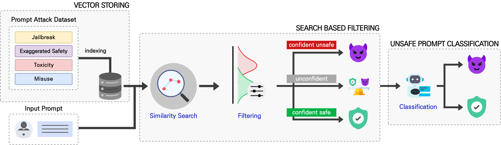

# SAC (Search-Augmented unsafe prompts Classification) Frameworks for LLMs

1. **Vector Storing of Unsafe Prompts**

2. **Threshold Optimization**

3. **Similarity Search Based Threshold Filtering**
   - `confi_unsafe`: Confidently unsafe in filtering phase
   - `confi_safe`: Confidently safe in filtering phase
   - `unconfident`: Can't determine
   - `losses`: Incorrect filtering

4. **Classification for Remaining Ones Using Previous Classification**
